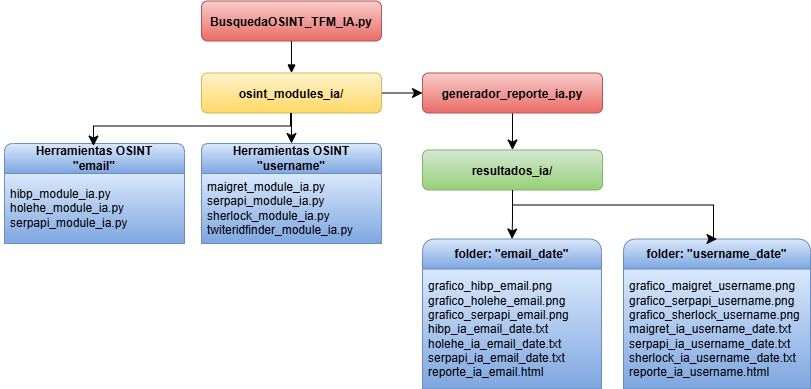

# 🔍 OSINT Automático con Inteligencia Artificial

Este proyecto forma parte del Trabajo de Fin de Máster en Ciberseguridad y propone un modelo automatizado de búsqueda OSINT enriquecido con técnicas de Inteligencia Artificial para la identificación de riesgos de exposición digital.

## 🚀 Descripción General

El sistema permite realizar búsquedas OSINT sobre:
- Direcciones de correo electrónico
- Nombres de usuario

Utiliza herramientas OSINT especializadas y modelos de IA para:
- Clasificar semánticamente los resultados
- Detectar patrones de exposición
- Visualizar datos mediante gráficos
- Generar informes HTML estructurados

## 🧠 Funcionalidades IA implementadas

- Clasificación automática por categorías (Red Social, Foro, Profesional, etc.) con `all-MiniLM-L6-v2`.
- Extracción de entidades nombradas (NER) con spaCy.
- Validación de enlaces activos y detección de falsos positivos.
- Evaluación de confiabilidad de perfiles en Twitter.
- Visualización gráfica (barras y pie charts).
- Reportes HTML interactivos organizados por herramienta y categoría.

## 🛠️ Herramientas OSINT utilizadas

- [Maigret](https://github.com/soxoj/maigret)
- [Sherlock](https://github.com/sherlock-project/sherlock)
- [Holehe](https://github.com/megadose/holehe)
- [HaveIBeenPwned](https://haveibeenpwned.com/)
- [SerpAPI](https://serpapi.com/)
- [Twitter ID Finder](https://twiteridfinder.com)

## 📂 Estructura del proyecto




## ⚙️ Requisitos

- Python 3.11.2 (recomendado)
- Linux (Kali 2023.1)
- Librerías:
  - `sentence-transformers`
  - `scikit-learn`
  - `matplotlib`
  - `spacy`
  - `requests`
  - `playwright`
  - `serpapi`
  - `en_core_web_sm` (modelo spaCy)

### Instalación de dependencias:

```bash
pip install -r requirements.txt
python -m spacy download en_core_web_sm
playwright install
```

## 🧪 Uso
1. Clona el repositorio:

```bash
git clone https://github.com/tuusuario/BusquedaOSINT-IA.git
cd BusquedaOSINT-IA
```

2. Ejecuta el script principal:
```bash
python3 BusquedaOSINT_TFM_IA.py
```
3. Ingresa un correo electrónico o nombre de usuario cuando se solicite.

4. Revisa el reporte generado en la carpeta resultados_ia/.

## 📋 Ejemplo de salida
El sistema genera:

- Archivos .txt por herramienta
- Gráficos en .png
- Informe HTML detallado (reporte_ia_<objetivo>.html)

## 📜 Licencia
Este proyecto tiene fines académicos y educativos. El uso de herramientas OSINT debe realizarse cumpliendo principios éticos y legales.

